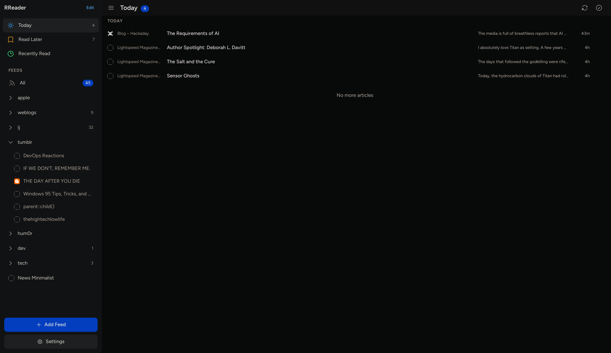
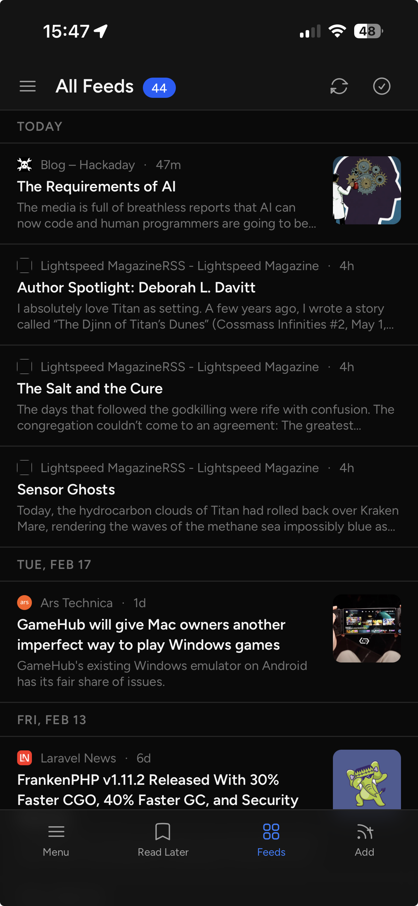

# RReader

Self-hosted RSS reader with a clean, minimal interface. Installable as a PWA on mobile and desktop.

<p align="center">
  
</p>

<p align="center">
  
</p>

## Features

- **Feed management** — subscribe, organize into categories, rename, reorder, OPML import/export
- **Reading modes** — all feeds, per-feed, per-category, today, read later, recently read
- **Mobile-first** — swipe to bookmark/dismiss, pull-to-refresh, pull-to-dismiss articles, bottom navigation
- **Desktop layout** — collapsible sidebar, keyboard shortcuts, three-column density
- **PWA** — installable, offline article viewing, reading position persistence across sessions
- **Background updates** — feeds refresh automatically every 30 minutes via queue worker
- **Dark mode** — follows system preference with manual override
- **Search** — full-text search across all articles

## Tech Stack

- **Backend** — Laravel 12, PHP 8.2+, SQLite
- **Frontend** — Vue 3, Inertia.js v2, Tailwind CSS v4, Vite 7
- **PWA** — vite-plugin-pwa with service worker for offline support

## Quick Setup

```bash
composer setup
```

This runs `composer install`, copies `.env.example`, generates the app key, runs migrations, installs npm packages, and builds the frontend.

## Development

```bash
composer dev
```

Starts the Laravel dev server, queue worker, log tail, and Vite dev server concurrently.

## Production Deployment

### 1. Environment

Copy `.env.example` to `.env` and configure:

```env
APP_ENV=production
APP_DEBUG=false
APP_URL=https://your-domain.com
```

Run `php artisan key:generate` if you haven't already.

### 2. Build

```bash
composer install --no-dev --optimize-autoloader
npm install
npm run build
php artisan migrate --force
```

### 3. Queue Worker (required)

A running queue worker is **required** — feed fetching, OPML imports, and background updates all run as queued jobs.

```bash
php artisan queue:work --tries=3
```

In production, run this as a supervised process (systemd, Supervisor, etc.) so it restarts automatically. See the [Laravel queue docs](https://laravel.com/docs/queues#supervisor-configuration) for Supervisor configuration.

### 4. Scheduler (required)

The scheduler automatically refreshes all feeds every 30 minutes. Add this cron entry:

```
* * * * * cd /path/to/rreader && php artisan schedule:run >> /dev/null 2>&1
```

### 5. Web Server

Point your web server (Nginx, Apache, Caddy, etc.) document root to the `public/` directory. HTTPS is **required** for the PWA service worker to function.

### 6. Permissions

Ensure these directories are writable by the web server:

- `storage/`
- `bootstrap/cache/`
- `database/` (if using SQLite)

## License

[MIT](LICENSE)
